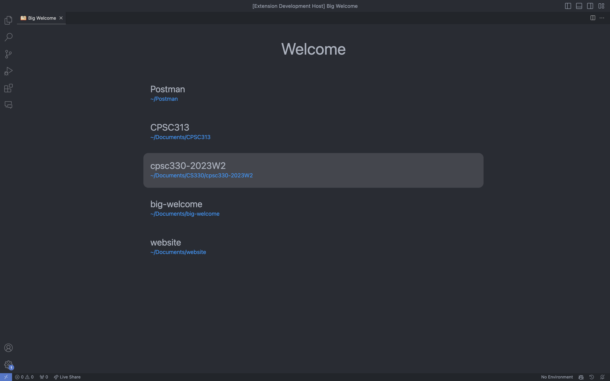

# Big Welcome README

Meant to replace the default VSCode welcome screen. When the workspace is empty this extension shows a window that lets you quickly open your recent workspaces.

This extension is best used when your last workspace does not open with VSCode. If you last workspace does open with VSCode then the welcome window will not get much use.

## Features

This is the window that will appear:

> Tip: Many popular extensions utilize animations. This is an excellent way to show off your extension! We recommend short, focused animations that are easy to follow.

## Known Issues

If workspace has multiple folders open this will only recognize the first one.

Extension will not warn user that their setting will prevent window from appearing on boot.

The settings button currently does not do anything

## Attribution

<a href="https://www.flaticon.com/free-icons/book" title="book icons">Book icon created by Freepik - Flaticon</a>

## Release Notes

### 1.1.1

Fixed icon path

### 1.1.0

New workspaces now appear on top. Changed icon & added extension icon in marketplace

### 1.0.0

Initial release of big-welcome!
